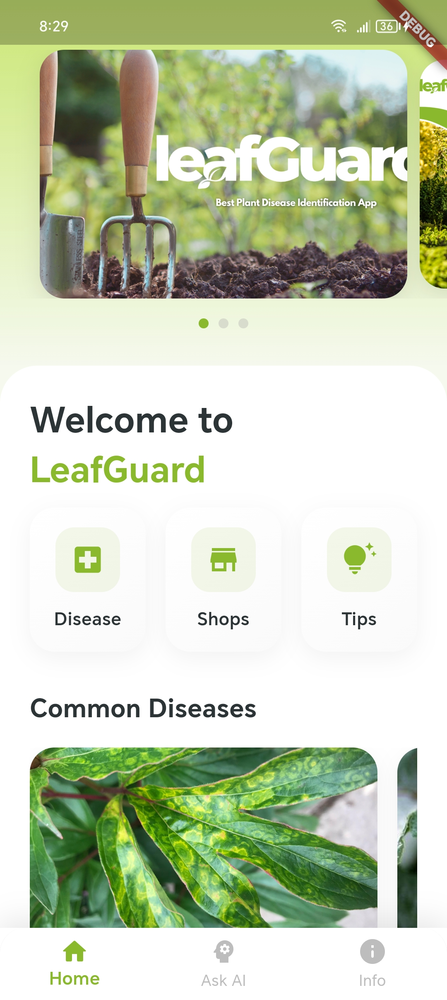
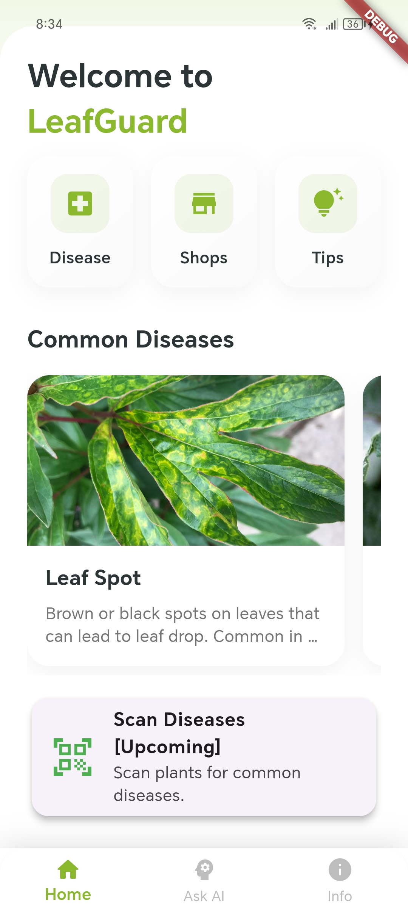
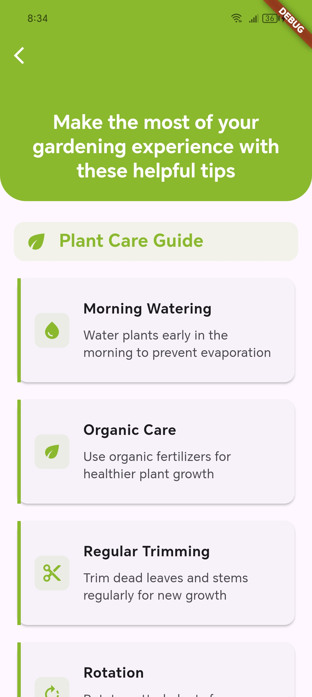
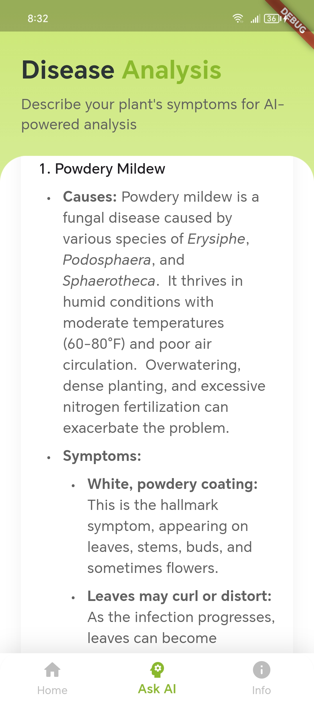
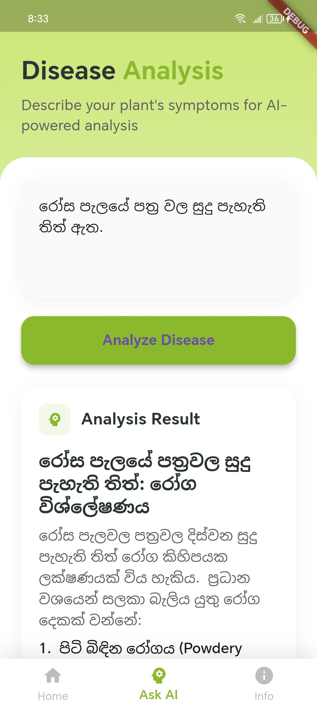
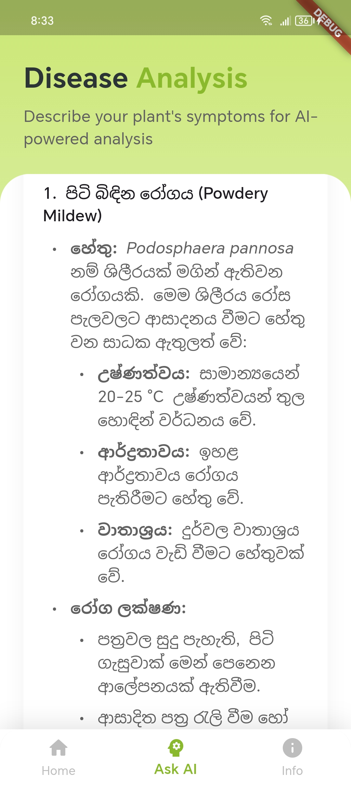
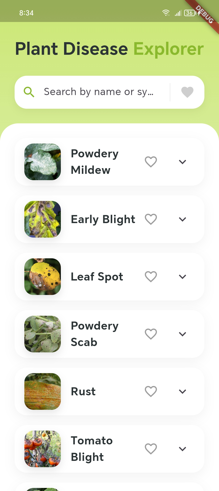
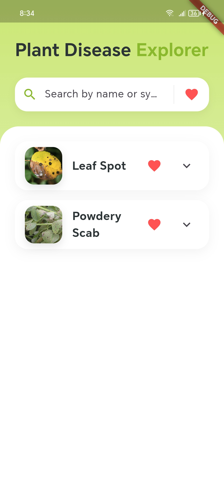
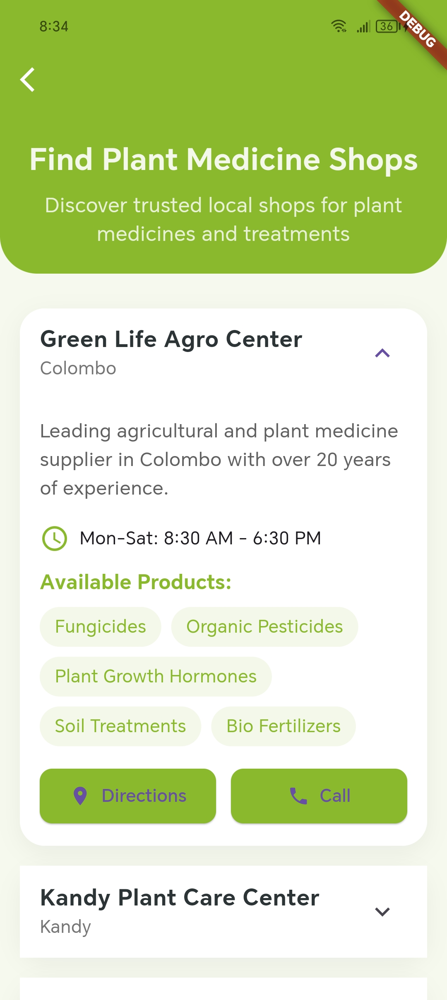

# LeafGuard 🌿

## Project Overview
LeafGuard is a comprehensive mobile application developed with Flutter that helps users identify and manage plant diseases. It combines local storage capabilities with Google's Gemini AI for intelligent disease detection and plant care recommendations. The application features a responsive interface and utilizes Firebase for backend services.


## Features

### 🔍 Disease Database
- **Local Storage:** Save and manage plant disease information offline
- **Comprehensive Database:** Detailed disease descriptions and treatments
- **Bookmarking:** Save frequently referenced diseases
- **Regular Updates:** Continuous database enrichment with new diseases

### 🏪 Local Shop Finder
- **Detailed Information:** Access shop profiles including:
  - Business hours
  - Contact details

### 🤖 AI Plant Disease Helper
- **Gemini AI Integration:** Advanced plant disease analysis
- **Smart Diagnosis:** Accurate disease identification powered by Google's Gemini AI
- **Treatment Recommendations:** AI-generated care suggestions
- **Interactive Interface:** User-friendly disease reporting

### 💡 Plant Care Tips
- **Seasonal Guides:** Context-aware plant care advice
- **Prevention Strategies:** Disease prevention techniques
- **Expert Content:** Professionally curated gardening tips

## Coming Soon 📱
### AI Plant Disease Scanner
- Real-time disease detection using Gemini AI Vision API
- Instant visual analysis and diagnosis
- Integration with existing disease database
- Scan history and progress tracking

## Technologies Used

### Frontend
- **Flutter:** Cross-platform development framework
- **Provider:** State management
- **SharedPreferences:** Local data storage

### Backend
- **JSON:** Lightweight data interchange format


### APIs
- **Gemini AI API:** Intelligent disease detection and analysis

## Technical Requirements

### Development Environment
- Flutter SDK 3.0 or higher
- Dart SDK 2.17 or higher
- Android Studio / VS Code
- Git
- Google Cloud Project with Gemini AI API enabled

### Mobile Requirements
- Android 5.0 (API level 21) or higher
- Camera access (for future scanner feature)
- Location services
- Internet connectivity

## Setup Guide

1. Clone the repository:
```bash
git clone https://github.com/yourusername/leafguard.git
```

2. Install dependencies:
```bash
cd leafguard
flutter pub get
```

3. Configure Firebase:
   - Create a Firebase project
   - Add Android/iOS apps in Firebase console
   - Download and add configuration files
   - Enable required Firebase services

4. Setup Gemini AI:
   - Enable Gemini AI API in Google Cloud Console
   - Generate API key
   - Add key to project configuration

5. Run the app:
```bash
flutter run
```


## Project Screenshots
| Home | Landing | Tips |
|------|---------|------|
|  |  |  |

| Analysis 1 | Analysis 2 | Analysis 3 |
|------------|------------|------------|
|  |  |  |

| Database 1 | Database 2 | Shop |
|------------|------------|------|
|  |  |  |


---
